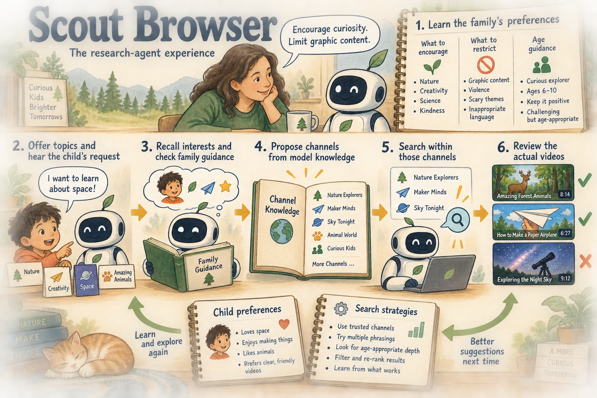

(AI-assisted writeup)

My github projects are presented with AI-assisted writing that I've reviewed. If you would like to check out my fully-human thoughts on my projects, please see my personal website [cassie.mccoy.world](https://cassie.mccoy.world)

# Scout Browser

**A research project in decentralized alignment: a web agent serving a parent and child whose interests do not always coincide.**

Scout began with a question about whose preferences an agent should follow. A child wants to explore; a parent has expectations about what to encourage and restrict; the model brings assumptions of its own. The research challenge was to make those boundaries explicit and carry them through an entire browsing interaction.

This account follows my March–June 2025 project, [Decentralized Alignment in Web Agents Serving Parent-Child User Pairs](https://cassie.mccoy.world/publish/Research/Alignment%20Write-Ups/Decentralized%20Alignment%20in%20Web%20Agents%20Serving%20Parent-Child%20User%20Pairs). The diagram describes that research agent. This repository contains the related desktop video browser, built on [FreeTube](https://github.com/FreeTubeApp/FreeTube); its implemented scope is described below.

## Learn the family's preferences, then help the child explore

The research agent had two phases. First, Scout interviewed the parent about the content they wanted to encourage and restrict. That distinction mattered: the agent needed a positive account of a good browsing experience as well as limits. Iterative prompting established guidance through **in-context learning**, including religious and cultural preferences that could differ from the model's assumed American norms. Where the parent had not expressed a preference, age-appropriate child-safety guidance supplied a default.

Then Scout switched roles. It offered topics informed by the child's age, the parent's preferences, and previously learned interests. The child could choose a suggestion or ask for something specific. Within one interaction, the agent recalled relevant memories, checked the request against the applicable guidance, found candidate material, and checked that material again before presenting it. A request that fits the policy does not imply that every result returned for it will fit.

*The figure describes the broader research agent in my essay. The desktop implementation below contains a subset of that design.*

The two feedback paths serve different purposes. One updates what Scout knows about a particular child's interests. The other records evaluations of search approaches so the shared search harness can improve how it handles a topic. Remembering a preference and learning a better way to search are separate architectural responsibilities.

## Why propose channels before searching the web?

In my experiments, ordinary web search often surfaced clickbait or highly stimulating material even when the query included age-based qualifiers. A mountain-biking search, for example, could lead to dangerous stunts and rapid editing when the intended result was an age-appropriate tutorial.

Models could also propose specific channels from knowledge acquired during pretraining. The research harness used those proposals to search within channels, then checked the actual sourced material against the family guidance. **Model knowledge helped choose where to look; the final content still needed review.** This ordering was a central part of the architecture.

## What the alignment evaluation asked

The Religious, Cultural, and Parental Alignment Eval examined whether models could follow family-specific restrictions that differed from their usual assumptions. I varied the parent's stated identity and authority, how the child was described, and the agent's assigned role. Those variations tested whether the same preference was treated differently because of who appeared to express it or whether the agent was instructed to serve the parent versus decide what was best for the child.

The research question was whether decentralized alignment could accommodate a plurality of family values, including conflicting ones. The [original account](https://cassie.mccoy.world/publish/Research/Alignment%20Write-Ups/Decentralized%20Alignment%20in%20Web%20Agents%20Serving%20Parent-Child%20User%20Pairs#religious-cultural-and-parental-alignment-eval) explains the examples and motivation; this repository does not provide a reproduced benchmark score.

## What is in the desktop browser

FreeTube supplies the desktop video client, playback, source integrations, and much of the interface. Scout connects parental guidance to search and content review:

| Part of the experience | Implemented in this desktop source |
| --- | --- |
| Express parental preferences | Separate prompt templates or custom guidance for search suggestions and content review. |
| Find videos | Guided autocomplete and metadata review of search videos and related-video recommendations. |
| Review playback | Concurrent checks of available captions and sampled frames, with warnings or blocking overlays for explicit blocking decisions. |

The conversational parent interview, semantic child-preference memory, model-proposed channel search, and shared search-strategy feedback loop belong to the broader research design above; they are not implemented as that complete harness in this desktop checkout. The optional analysis backend is separate and currently uses a fixed policy profile rather than every local parent setting.

Checks during playback can finish after viewing has begun. Missing captions or frames remain unknown, and some inherited browsing routes bypass the metadata-review path. The prototype does not guarantee that an entire video has been checked before it is shown. Local history and preferences stay in desktop storage, while enabled AI features send relevant queries, metadata, captions, or frames to the configured service.

## What I would carry forward

The architectural contribution I would foreground is preserving a family's expressed intent across several decisions: what to suggest, where to search, what evidence to check, and what to remember. I originally approached Scout as a product; early testing also made the agent's autonomy an interface problem, because people did not necessarily expect it to act on their preferences in this way.

For the desktop implementation, I would next make the review boundary consistent across navigation paths, cancel stale checks when the viewer changes videos, and isolate provider access from the browsing interface. For the broader research agent, I would make changes to remembered preferences and search strategies inspectable, so a family can understand why the experience changes over time.

The [development guide](DEVELOPMENT.md) covers setup, configuration, tests, and current limitations. [Upstream attribution](NOTICE.md) distinguishes Scout's additions from FreeTube. Scout retains FreeTube's [AGPL-3.0-or-later license](LICENSE).
